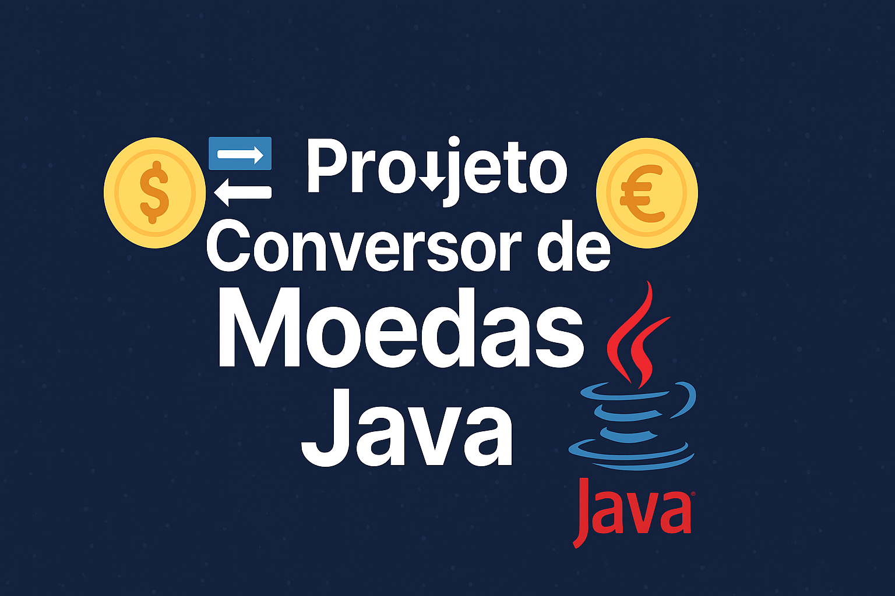
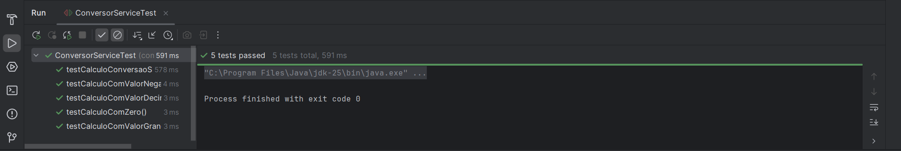

# 💱 Projeto Conversor de Moedas – Java  

## 🚀 Projeto Prático em Java  
### 📚 Integração com API + 🌐 JSON/Gson + 🧪 Testes Unitários (JUnit 5)  



---

## 🏅 Badges  

  
  
  
  
  

---

## 📑 Índice / Table of Contents  

- [📖 Descrição / Description](#-descrição--description)  
- [📌 Status do Projeto / Project Status](#-status-do-projeto--project-status)  
- [⚙️ Estrutura / Structure](#️-estrutura--structure)  
- [🧪 Testes / Tests](#-testes--tests)  
- [▶️ Execução / Run Instructions](#️-execução--run-instructions)  
- [🧰 Tecnologias / Technologies](#-tecnologias--technologies)  
- [👨‍💻 Desenvolvedor / Developer](#-desenvolvedor--developer)  
- [📜 Licença / License](#-licença--license)  
- [🏁 Conclusão / Conclusion](#-conclusão--conclusion)  

---

## 📖 Descrição / Description  

**PT:**  
Este projeto prático em **Java** implementa um **Conversor de Moedas** que:  
- Consome uma **API de câmbio** para obter taxas de conversão.  
- Utiliza a biblioteca **Gson** para manipulação de JSON.  
- Possui uma camada de serviço (`ConversorService`) responsável pelos cálculos.  
- Inclui **testes unitários com JUnit 5** para validar a lógica de conversão.  

**EN:**  
This practical **Java project** implements a **Currency Converter** that:  
- Consumes an **exchange rate API** to fetch conversion rates.  
- Uses **Gson** library for JSON handling.  
- Has a service layer (`ConversorService`) responsible for calculations.  
- Includes **JUnit 5 unit tests** to validate conversion logic.  

---

## 📌 Status do Projeto / Project Status  

  

**PT:**  
Este projeto está **concluído e funcional**.  

**EN:**  
This project is **completed and functional**.  

---

## ⚙️ Estrutura / Structure  

```text
ProjetoConversorDeMoedas/
 ├── lib/                         # Bibliotecas externas (.jar)
 │    ├── gson-2.13.2.jar
 │    ├── junit-jupiter-api-5.10.2.jar
 │    ├── junit-jupiter-engine-5.10.2.jar
 │    └── junit-platform-console-standalone-1.10.2.jar
 │
 ├── src/com/rogerio/conversor/   # Código principal
 │    ├── Main.java
 │    ├── Menu.java
 │    ├── ApiClient.java
 │    ├── ConversorService.java
 │    └── models/
 │         └── ExchangeResponse.java
 │
 ├── test/com/rogerio/conversor/  # Testes unitários
 │    └── ConversorServiceTest.java
 │
 └── README.md                    # Documentação
```

---

🧪 Testes / Tests
Foram implementados 5 testes unitários no arquivo ConversorServiceTest.java, cobrindo:

✅ Conversão simples (caso normal)

✅ Conversão com valor zero

✅ Conversão com valor negativo

✅ Conversão com valor decimal

✅ Conversão com valor grande

Exemplo de teste:
```
@Test
void testCalculoComValorDecimal() {
    ConversorService service = new ConversorService();
    double resultado = service.calcular(12.34, 4.56);
    assertEquals(56.2704, resultado, 0.0001);
}
```
📌 Resultado esperado: todos os testes passaram com sucesso ✅



---

▶️ Execução / Run Instructions
PT:

Certifique-se de ter o Java 17+ instalado.

Baixe as dependências externas (gson e junit) e coloque na pasta lib/.

No IntelliJ IDEA:

Vá em File → Project Structure → Libraries e adicione os .jar da pasta lib.

Marque a pasta test como Test Sources Root.

Para rodar o programa:

Execute a classe Main.java.

Para rodar os testes:

Clique com o botão direito em ConversorServiceTest.java → Run 'ConversorServiceTest'.

EN:

Make sure you have Java 17+ installed.

Download external dependencies (gson and junit) and place them in the lib/ folder.

In IntelliJ IDEA:

Go to File → Project Structure → Libraries and add the .jar files from lib/.

Mark the test folder as Test Sources Root.

To run the program:

Execute the Main.java class.

To run the tests:

Right-click ConversorServiceTest.java → Run 'ConversorServiceTest'

---

🧰 Tecnologias / Technologies
PT: Este projeto foi desenvolvido utilizando as seguintes tecnologias e ferramentas:

EN: This project was built using the following technologies and tools:

<p align="left">      </p>

---

## 👨‍💻 Desenvolvedor / Developer

- [Rogerio](https://github.com/Rogerio5)

---

## 📜 Licença / License

Este projeto está sob licença MIT. Para mais detalhes, veja o arquivo `LICENSE`.  

This project is under the MIT license. For more details, see the `LICENSE` file.

---

🏁 Conclusão / Conclusion

PT: Este projeto consolida meu aprendizado em Java, integrando consumo de API, manipulação de JSON com Gson e testes unitários com JUnit 5. Ele demonstra boas práticas de organização de código e serve como base para projetos mais complexos.

EN: This project consolidates my Java learning, integrating API consumption, JSON handling with Gson, and unit testing with JUnit 5. It demonstrates good coding practices and serves as a foundation for more complex projects.
